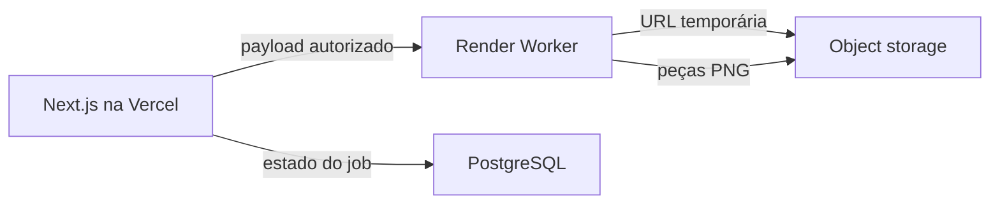

# Arquitetura de renderização do Studio

A AutoWeb orquestra; o worker Python renderiza. A divisão existe porque o
motor validado carrega PyTorch e YOLO e leva dezenas de segundos por lote —
carga que não cabe na Vercel e que não vale reescrever.

## Quem faz o quê

A aplicação autentica o usuário, resolve a revenda, confere permissão e plano,
valida que veículo e fotos pertencem àquela revenda, cria o projeto e o job,
monta o payload e grava o resultado. Ela é a única que fala com o worker.

O worker recebe o payload pronto, baixa as fotos, roda o detector, calcula o
enquadramento, compõe o card, executa o QC e devolve o resultado. Ele não
conhece sessão, CRM, plano nem banco da AutoWeb, e não consulta o PostgreSQL
principal: reduzir o acoplamento reduz a superfície de ataque.

## Segurança

O worker não é uma API pública. Toda chamada carrega `x-worker-token`
(`RENDER_WORKER_SECRET`), comparado com `compare_digest`; sem ele a resposta
é 401. O segredo vive só no servidor, nunca no cliente.

O `dealershipId` no payload serve para rastreabilidade e para compor a chave
de storage — não é fonte de autorização. Quem decide o que a revenda pode
tocar é a AutoWeb, antes de chamar o worker, e há teste para isso.

O bucket continua privado. As fotos chegam ao worker por URL assinada de 15
minutos; o banco guarda a `storageKey`, nunca a URL, porque ela expira.

## Contratos

`RenderInput` v1 leva revenda, veículo, fotos (com ordem), template e
configurações. `RenderResult` devolve, por card: a mídia de origem, a posição,
a chave no storage, o grupo, o tipo detectado, o enquadramento (zoom e
âncoras), as métricas do QC e os alertas.

Guardar o enquadramento é o que permite reeditar um card sem reanalisar o
lote: `POST /v1/render/card` refaz um só.

## Estados

O estado vive no PostgreSQL, não na memória do Python — um worker reiniciado
não pode apagar o que aconteceu.

`content_projects.status`: DRAFT, QUEUED, PROCESSING, REVIEW, COMPLETED,
FAILED. Cada tentativa é uma linha em `render_jobs`, com `attempt`,
`engineVersion` e o erro daquela vez, de modo que um retry não apaga o
diagnóstico anterior.

Uma peça reprovada no QC leva o projeto a REVIEW, não a FAILED: o resultado é
aproveitável, só precisa de olhar humano.

## Versionamento

`ENGINE_VERSION` (`carmulti-v7-autoweb-1`) e `templateKey`/`templateVersion`
ficam gravados no job e no projeto. Um template v2 no futuro não muda o que
um projeto antigo era.

## Templates

O template da Carmulti trazia logo, endereço e telefone de uma revenda só.
Num produto multi-revenda isso não serve, então o template da AutoWeb é
neutro e a identidade entra por slots: logo, cor e contato vêm do cadastro da
revenda. O template original segue disponível para comparação de regressão.

A área da fotografia continua marcada em magenta puro e detectada por
`detectar_slot()` — solução simples que já funcionava.

## Erros

O worker classifica: INVALID_INPUT, INPUT_DOWNLOAD_FAILED, MODEL_LOAD_FAILED,
RENDER_FAILED, UPLOAD_FAILED, TIMEOUT, INTERNAL_ERROR. O banco guarda o código
e a mensagem técnica; a interface mostra um texto amigável
(`renderErrorMessages`). Nada de SQL, stack trace ou credencial chega ao
usuário.

## Limites conhecidos

Um job por processo. O lote de 11 fotos leva 40 a 60 segundos, e concorrência
alta derruba o serviço por memória antes de acelerar qualquer coisa.

A AutoWeb consulta o estado do job; não há push do worker para o navegador.
Para a Etapa 2B isso basta.
